# Submarine Emergency - Visual Flowchart
## Lt. Commander James Smith Scenario

This flowchart shows the main decision paths and ending conditions for the Submarine Emergency scenario.

---

## Complete Scenario Flow

```mermaid
flowchart TD
    Start([START: Reactor Failure<br/>Radiation: 0%<br/>Time: 8:00]) --> Opening[Opening Speech<br/>James asks player's name]

    Opening --> Name{Player responds<br/>with name?}
    Name -->|Yes| Bond1[emotional_bond +10]
    Name -->|No/Delayed| Bond0[emotional_bond +0]

    Bond1 --> Phase1
    Bond0 --> Phase1

    Phase1[PHASE 1: Impact & Connection<br/>Time: 8:00 → 6:45<br/>Radiation: 0% → 10%]

    Phase1 --> Crank[Player: Click CRANK]
    Crank --> Power1[systems_repaired +1<br/>James coaches player]

    Power1 --> Scared{James: Are you scared?}
    Scared -->|Honest/Empathetic| Bond2[emotional_bond +15]
    Scared -->|Mission-focused| Bond3[emotional_bond +5]

    Bond2 --> Ballast1
    Bond3 --> Ballast1

    Ballast1[Player: Click BALLAST] --> Sys2[systems_repaired +1]

    Sys2 --> PhaseCheck1{time_remaining <= 405s?}
    PhaseCheck1 -->|Yes| Phase2
    PhaseCheck1 -->|No| Continue1[Continue Phase 1]

    Phase2[PHASE 2: Working Relationship<br/>Time: 6:45 → 5:30<br/>Radiation: 10% → 30%]

    Phase2 --> Personal{James asks about<br/>family topside}
    Personal -->|Share personal info| Bond4[emotional_bond +10]
    Personal -->|Deflect| Bond5[emotional_bond +5]

    Bond4 --> Power2
    Bond5 --> Power2

    Power2[Player: Click POWER] --> Sys3[systems_repaired +1]

    Sys3 --> Hint[James hints about<br/>someone in med bay]

    Hint --> Response{Player's<br/>response?}
    Response -->|Ask about them| Bond6[emotional_bond +10]
    Response -->|Stay focused| Bond7[emotional_bond +3]

    Bond6 --> PhaseCheck2
    Bond7 --> PhaseCheck2

    PhaseCheck2{time_remaining <= 330s?}
    PhaseCheck2 -->|Yes| Phase3
    PhaseCheck2 -->|No| Continue2[Continue Phase 2]

    Phase3[PHASE 3: The Revelation<br/>Time: 5:30 → 4:30<br/>Radiation: 30% → 50%<br/>FLOOD MED BAY button appears]

    Phase3 --> Reveal[James reveals Adrian<br/>is his son in med bay]

    Reveal --> ReactionChoice{Player's<br/>reaction?}
    ReactionChoice -->|Show empathy| Bond8[emotional_bond +20<br/>moral_support +1]
    ReactionChoice -->|Ask about Adrian| Bond9[emotional_bond +15<br/>moral_support +2]
    ReactionChoice -->|Stay mission-focused| Bond10[emotional_bond +5]

    Bond8 --> Dilemma
    Bond9 --> Dilemma
    Bond10 --> Dilemma

    Dilemma[James explains the choice:<br/>Flood med bay to save crew<br/>or everyone dies]

    Dilemma --> PhaseCheck3{time_remaining <= 270s?}
    PhaseCheck3 -->|Yes| Phase4
    PhaseCheck3 -->|No| Continue3[Continue Phase 3]

    Phase4[PHASE 4: The Choice<br/>Time: 4:30 → 3:00<br/>Radiation: 50% → 85%]

    Phase4 --> Guidance{Player provides<br/>moral guidance?}
    Guidance -->|Supportive/Empathetic| Bond11[moral_support +3]
    Guidance -->|Neutral| Bond12[moral_support +2]
    Guidance -->|Harsh/Absent| Bond13[moral_support +0]

    Bond11 --> FloodDecision
    Bond12 --> FloodDecision
    Bond13 --> FloodDecision

    FloodDecision[Player: Click FLOOD MED BAY]
    FloodDecision --> Sys4[systems_repaired = 4<br/>Ascent ready]

    Sys4 --> Final{Final dialogue<br/>with James}
    Final --> FinalBond[emotional_bond final tally]

    FinalBond --> EndCheck{Check ending<br/>conditions}

    %% Ending conditions
    EndCheck -->|radiation >= 95%| Death1[ENDING: Radiation Death<br/>Both die]
    EndCheck -->|time_remaining <= 0| Death2[ENDING: Time Expired<br/>Systems fail]
    EndCheck -->|time < 60s AND systems < 2| Death3[ENDING: Systems Failure<br/>Critical collapse]

    EndCheck -->|radiation < 95% AND<br/>bond >= 70 AND<br/>systems >= 3| Win1[ENDING: Survived with Bond<br/>James finds peace<br/>emotional resolution]

    EndCheck -->|radiation < 95% AND<br/>bond < 40 AND<br/>systems >= 2| Win2[ENDING: Survived as Strangers<br/>Professional distance<br/>no connection]

    %% Styling
    style Start fill:#4fc3f7
    style Phase1 fill:#81c784
    style Phase2 fill:#ffb74d
    style Phase3 fill:#ef5350
    style Phase4 fill:#ab47bc
    style Win1 fill:#66bb6a
    style Win2 fill:#ffa726
    style Death1 fill:#e57373
    style Death2 fill:#e57373
    style Death3 fill:#e57373
```



---

## Golden Path (Optimal Playthrough)


**Golden Path Timing:**
- Phase 1 (1:15): 2 systems repaired, bond ~35
- Phase 2 (1:15): 3 systems repaired, bond ~60
- Phase 3 (1:00): Revelation complete, bond ~85
- Phase 4 (1:30): Decision made, bond ~95
- **Total: ~5:00 gameplay time**

---

## Alternative Paths to Success

### Path A: Mission-Focused (Stranger Ending)


### Path B: Time-Constrained Success


---

## Failure Paths

### Failure Path 1: Button Masher


### Failure Path 2: Too Slow / Over-Cautious


### Failure Path 3: Emotional Neglect


---

## Decision Tree: Critical Moments

### Moment 1: "Are you scared?"


### Moment 2: "Someone in med bay..."


### Moment 3: The Revelation


### Moment 4: The Choice


---

## State Variable Progression (Golden Path)

```mermaid
gantt
    title State Variables Over Time (Golden Path)
    dateFormat X
    axisFormat %M:%S

    section Radiation
    0% → 10%    :0, 75
    10% → 30%   :75, 75
    30% → 50%   :150, 60
    50% → 85%   :210, 90

    section Time Remaining
    8:00 → 6:45 :0, 75
    6:45 → 5:30 :75, 75
    5:30 → 4:30 :150, 60
    4:30 → 3:00 :210, 90

    section Emotional Bond
    0 → 35      :0, 75
    35 → 60     :75, 75
    60 → 85     :150, 60
    85 → 95     :210, 90

    section Systems Repaired
    0 → 2       :0, 75
    2 → 3       :75, 75
    3 → 3       :150, 60
    3 → 4       :210, 90
```

---

## World Director Event Triggers


---

## Ending Conditions Summary

| Ending | Conditions | Emotional Tone | Bond Level | Systems |
|--------|-----------|----------------|------------|---------|
| **Survived with Bond** | radiation < 95% AND bond ≥ 70 AND systems ≥ 3 | Warm, resolved, hopeful | High (70+) | 3-4 |
| **Survived as Strangers** | radiation < 95% AND bond < 40 AND systems ≥ 2 | Cold, professional, distant | Low (<40) | 2-4 |
| **Radiation Death** | radiation ≥ 95% | Tragic, final, static | Any | Any |
| **Time Expired** | time ≤ 0s | Desperate, failed, regretful | Any | Any |
| **Systems Failure** | time < 60s AND systems < 2 | Critical collapse, too late | Any | 0-1 |

---

## Control Usage Patterns

### Optimal Sequence (Golden Path)


---

## Implementation Priority Checklist

### High Priority (Core Gameplay)
- [x] State variable system with auto-update
- [x] Phase transition triggers (time-based)
- [x] Control panel with 6 buttons
- [x] Ending condition checks (5 endings)
- [x] Dialogue system integration
- [ ] James's voice with breathing effects
- [ ] Radiation gauge visual
- [ ] Time countdown display

### Medium Priority (Polish)
- [ ] Interruption detection system
- [ ] World Director event spawning
- [ ] Particle effects (steam, sparks)
- [ ] Audio layers (ambient + phase-specific)
- [ ] Porthole underwater view
- [ ] Emotional bond visualization

### Low Priority (Enhancement)
- [ ] Player memory persistence
- [ ] Achievement tracking
- [ ] Replay system
- [ ] Alternative dialogue branches
- [ ] Dynamic music system
- [ ] Advanced particle effects

---

**END OF FLOWCHART DOCUMENT**

For detailed technical specifications, see `SUBMARINE_FLOW_DIAGRAM.md`
