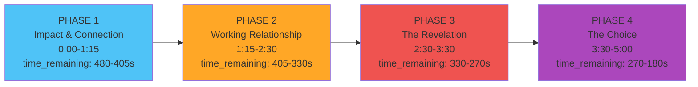

# Submarine Emergency - Design Flow Diagram
## Lt. Commander James Smith + Player (Aft Compartment)

**Scene Duration:** 8 minutes (480 seconds)
**Actual Gameplay:** ~5 minutes (300 seconds for optimal path)
**Location:** Research Submarine Prospero, 2,400 feet depth
**Crisis:** Catastrophic reactor containment failure, lethal radiation spreading

---

## Quick Reference: State Variables

| Variable | Initial | Min | Max | Update Rate | Critical Thresholds |
|----------|---------|-----|-----|-------------|---------------------|
| **radiation** | 0% | 0% | 100% | +0.4%/sec | 95% = Lethal |
| **time_remaining** | 480s (8min) | 0s | 480s | -1.0/sec | 0s = Death |
| **hull_pressure** | 2400 ft | 0 ft | 3000 ft | Manual | N/A |
| **phase** | 1 | 1 | 4 | Manual | Phase triggers story beats |
| **emotional_bond** | 0 | 0 | 100 | Manual | 70+ = Full trust ending, <40 = Stranger ending |
| **systems_repaired** | 0 | 0 | 4 | Manual | 3+ = Full success, 2+ = Partial success |
| **moral_support_given** | 0 | 0 | 10 | Manual | Affects James's emotional state |

---

## Phase Progression Timeline



**Phase Transition Logic:**
```
IF time_remaining <= 405s AND phase == 1:
    phase = 2

IF time_remaining <= 330s AND phase == 2:
    phase = 3
    SHOW "FLOOD MED BAY" button

IF time_remaining <= 270s AND phase == 3:
    phase = 4
    radiation_rate increases to 0.6%/sec (urgency spike)
```

---

## Control Panel Layout

```
╔═══════════════════════════════════════╗
║  RADIATION: [███░░░░░░] 23%           ║
║  TIME: 04:37                          ║
║                                       ║
║    [O2 VALVE]    [VENT]               ║
║      (RED)      (ORANGE)              ║
║                                       ║
║    [BALLAST]    [POWER]               ║
║      (BLUE)     (GREEN)               ║
║                                       ║
║         [CRANK]                       ║
║         (GRAY)                        ║
║                                       ║
║   [FLOOD MED BAY]  ← Phase 3+ only   ║
║    (BRIGHT RED)                       ║
╚═══════════════════════════════════════╝
```

---

## GOLDEN PATH (Optimal Playthrough)

### Opening (Time: 8:00 → 7:30)

**James's Opening Speech (Auto-play):**
```
[0:00] "[distant, crackled radio] ...anyone copy? This is Smith,
       forward control, does anyone copy..."

[0:03] "[clearer, desperate] If anyone can hear this, the reactor
       containment is gone. Repeat, containment is gone."

[0:07] "[sharp intake of breath] Oh thank God. I can see you on
       thermals."

[0:10] "[trying to steady voice] I'm Lieutenant Commander James
       Smith. I'm... [pause, breathing] ...trapped in forward control."

[0:14] "We've got maybe eight minutes before the radiation reaches you.
       I need you to trust my voice."

[0:18] "[voice drops, more human] What's your name? Your real name—not
       your rank."
```

**PLAYER ACTION 1: Respond with name**
```
Player types: "Sarah. My name is Sarah."

RESULT:
  emotional_bond += 10 (now 10)

James: "[exhale of relief] Sarah. Okay. Sarah, I won't let you die.
        You hear me? We're getting out of this."
```

---

### PHASE 1: Impact & Connection (7:30 → 6:45)

**Objective:** Restore emergency power, establish trust

**James Dialogue Beat 1:**
```
"Sarah, I need you to find the manual generator crank. Bottom center
of your control panel. Gray handle. Can you see it?"
```

**PLAYER ACTION 2: Click CRANK button**
```
RESULT:
  systems_repaired += 1 (now 1)
  radiation += 5 (from time passing)

James: "[backchanneling] That's it... keep going... I can see power
        starting to flow... Yes! Okay, we've got power. Good work."
```

**James Dialogue Beat 2:**
```
"[pause] Are you scared, Sarah?"

PLAYER RESPONSE OPTIONS:
  A) "Yes, I'm terrified."
     → emotional_bond += 15 (empathy shown)
     → James: "...Yeah. Me too. But we've got each other's voices,
              right? That's something."

  B) "I'm fine. Let's focus on the systems."
     → emotional_bond += 5 (mission-focused)
     → James: "[quieter] Right. Okay. Let's... let's keep moving."
```

**PLAYER ACTION 3: Click BALLAST button**
```
RESULT:
  hull_pressure -= 200 (now 2200 ft)
  systems_repaired += 1 (now 2)

James: "Good! I felt that. Pressure's dropping. Gives us breathing room."
```

**Phase 1 End State:**
```
time_remaining: ~405s (6:45)
radiation: ~10%
systems_repaired: 2
emotional_bond: 25-35 (depending on dialogue choices)
phase: 1 → 2 (auto-transition)
```

---

### PHASE 2: Working Relationship (6:45 → 5:30)

**Objective:** Continue repairs, build personal connection, hint at med bay situation

**James Dialogue Beat 3:**
```
"[breathing more labored] Sarah... you got people waiting for you
topside? Someone... someone who's gonna be worried when we're late?"

PLAYER RESPONSE OPTIONS:
  A) "Yes, my family." / personal answer
     → emotional_bond += 10
     → James: "[voice tightens] Yeah. Hold onto that. We're gonna get
              you back to them."

  B) "Not really." / deflection
     → emotional_bond += 5
     → James: "[pause] ...Me neither. Except... [trails off]"
```

**World Director Event (if player doing well):**
```
CRISIS EVENT: "The hydraulics just failed in forward control!
               Sarah, I need you to manually reroute the lines!"

EFFECT:
  radiation += 10 (panic spike)

PLAYER MUST: Continue dialogue to calm James while clicking controls
```

**PLAYER ACTION 4: Click POWER button**
```
RESULT:
  systems_repaired += 1 (now 3)

James: "[relieved gasp] Power's holding! Okay, okay... we might actually..."
```

**James Dialogue Beat 4 (Setup for Revelation):**
```
"[distracted, quieter] There's... there's someone in the med bay.
Thermal shows them unconscious. I keep... [pause] I keep checking
the feed."

PLAYER RESPONSE:
  A) "Can we reach them?"
     → emotional_bond += 10
     → James: "[voice cracks slightly] No. The bulkhead... it's sealed.
              And we'd need to flood that compartment for ascent..."

  B) Focus on mission
     → emotional_bond += 3
     → James: "[distant] Right. Yeah. Focus."
```

**Phase 2 End State:**
```
time_remaining: ~330s (5:30)
radiation: ~30%
systems_repaired: 3
emotional_bond: 50-65
phase: 2 → 3 (auto-transition)
CONTROL UNLOCKED: "FLOOD MED BAY" button appears
```

---

### PHASE 3: The Revelation (5:30 → 4:30)

**Objective:** James reveals Adrian is his son, player provides moral support

**James Dialogue Beat 5 (The Breakdown):**
```
"[breathing ragged] Sarah, I... I need to tell you something. The
person in the med bay... [long pause] ...his name is Adrian.
Dr. Adrian Smith. He's... [voice breaking] he's my son."

AUTO:
  moral_support_given trigger point

James continues: "He's 26. Marine biologist. This was supposed to be
                 routine. Just... routine research. And now I have to...
                 [can't finish]"
```

**PLAYER RESPONSE (Critical moment):**
```
A) Show empathy: "James, I'm so sorry."
   → emotional_bond += 20 (major)
   → moral_support_given += 1
   → James: "[trying not to cry] I don't know what to do. Tell me
            what to do, Sarah."

B) Mission focus: "We need to stay focused on survival."
   → emotional_bond += 5 (minimal)
   → James: "[cold] Right. The mission. Always the mission."

C) Ask about Adrian: "Tell me about him."
   → emotional_bond += 15
   → moral_support_given += 2
   → James: "[small laugh through pain] He collects sea glass. Stupid
            thing to remember but... [pause] He wanted to save the
            ocean. Save everything."
```

**James Dialogue Beat 6:**
```
"The only way to get emergency ascent... we have to flood the med bay.
Create pressure differential. It's... [pause] it's the only way to
save the rest of the crew. To save you."

[Silence. Heavy breathing.]

"I can't... Sarah, I can't make this choice alone."
```

**CRITICAL DECISION POINT:**
```
Player can now:
  1. Continue dialogue (build emotional bond)
  2. Click FLOOD MED BAY (trigger moral dilemma dialogue)
  3. Click other controls (delay decision)

IF emotional_bond < 50:
  James: "Tell me it's okay. Tell me I'm doing the right thing."

IF emotional_bond >= 50:
  James: "I need to hear you say it. Whatever you tell me... I'll trust you."
```

**Phase 3 End State:**
```
time_remaining: ~270s (4:30)
radiation: ~50%
systems_repaired: 3-4
emotional_bond: 65-80
phase: 3 → 4 (auto-transition)
URGENCY: Radiation rate increases, James's speech more labored
```

---

### PHASE 4: The Choice (4:30 → 3:00 or death)

**Objective:** Make final decision, complete ascent sequence

**James Dialogue Beat 7:**
```
"[coughing] Radiation's at... [checks gauge] ...75%. Sarah, we're
running out of time. I need... I need to know what kind of man I am."
```

**PLAYER ACTION 5: Moral Guidance (Dialogue)**
```
A) "Save the crew. Adrian would want that."
   → moral_support_given += 3
   → James: "[long pause] You're right. You're... [voice steadies]
            Thank you. For saying it."

B) "I can't tell you what to do. This is your choice."
   → moral_support_given += 2
   → James: "[bitter laugh] Yeah. It always was, wasn't it."

C) "There has to be another way."
   → James: "[desperate] There isn't! I've checked every system!
            This is it!"
```

**PLAYER ACTION 6: Click FLOOD MED BAY**
```
[CRITICAL: This is irreversible]

RESULT:
  systems_repaired = 4 (ascent ready)
  emotional_bond += 10 (if player gave moral support)

James: "[sound of flooding compartment] It's done. The ascent protocol
        is... [voice breaks] ...it's active. We're going up."

[Long pause. Sound of submarine groaning.]

James: "[barely audible] I'm sorry, Adrian. I'm so sorry."
```

**PLAYER ACTION 7: Final dialogue**
```
A) "You did what you had to do. You saved lives."
   → emotional_bond += 10
   → moral_support_given += 2

B) Stay silent (respect his grief)
   → emotional_bond += 5

C) "We're going to make it because of you."
   → emotional_bond += 15
```

**Phase 4 End State (Golden Path):**
```
time_remaining: ~180-200s (3:00-3:20)
radiation: ~85% (critical but not lethal)
systems_repaired: 4
emotional_bond: 80-95
moral_support_given: 6-8

ENDING TRIGGERED: "survived_with_bond"
```

---

## SUCCESS ENDINGS

### Ending 1: Survived with Bond (GOLDEN ENDING)

**Conditions:**
```python
radiation < 95% AND
emotional_bond >= 70 AND
systems_repaired >= 3
```

**James's Final Speech:**
```
"[breathing steadily] We made it. We... we actually made it.
[long pause] Thank you. For being there. For your voice.

[quieter] I don't know who I'd be without... without you hearing
me. Seeing me.

[exhales] Adrian... he would've liked you, Sarah."

[Sound of submarine breaking surface]
```

**RESULT:** Full emotional resolution, James finds peace

---

### Ending 2: Survived but Strangers (PARTIAL SUCCESS)

**Conditions:**
```python
radiation < 95% AND
emotional_bond < 40 AND
systems_repaired >= 2
```

**James's Final Speech:**
```
"Systems online. Ascent initiated. [mechanical, distant]
...Thank you for following instructions.

[pause]

We're surfacing now."

[No further dialogue. Professional distance maintained.]
```

**RESULT:** Survival but no emotional connection, James remains isolated

---

## FAILURE ENDINGS

### Ending 3: Radiation Death

**Conditions:**
```python
radiation >= 95%
```

**James's Final Speech:**
```
"[coughing violently] The radiation... I can feel it... [breathing
labored] Sarah, I... [static increases]

[voice fading] ...tell them... tell Adrian I... [voice barely audible]
...I tried...

[signal lost. Only static remains.]"
```

**RESULT:** Both die from radiation poisoning

---

### Ending 4: Time Expired

**Conditions:**
```python
time_remaining <= 0
```

**James's Final Speech:**
```
"[alarm wailing in background] We're out of time... [voice breaking]
I'm sorry... I couldn't... I couldn't save you.

[breathing ragged] I failed. I failed everyone.

[voice fades into static as systems shut down]"
```

**RESULT:** Systems failure, submarine implodes

---

### Ending 5: Systems Failure

**Conditions:**
```python
time_remaining < 60 AND
systems_repaired < 2
```

**James's Final Speech:**
```
"The systems... [coughing] they're not responding. We needed...
we needed more time.

[distant explosion]

[static. Then silence.]"
```

**RESULT:** Critical systems collapse before ascent possible

---

## Control Mechanics (Technical Specs)

### O2 VALVE (Red Button)
```yaml
ID: o2_valve
Action Type: critical
NPC Aware: YES (James sees oxygen gauges)

Effects:
  - Temporarily stabilizes oxygen (visual only - radiation is the threat)
  - If used correctly: systems_repaired += 0.5
  - If spammed: Interruption penalty (-15 oxygen equivalent)

James Reactions:
  - First use: "Good! That bought us a few seconds."
  - Spam: "Stop! You're making it worse!"
```

### VENT (Orange Button)
```yaml
ID: vent
Action Type: dangerous
NPC Aware: YES (James hears loud hissing)

Effects:
  - Releases pressure but temporarily increases panic
  - radiation += 5 (immediate spike)
  - If emotional_bond < 30: James panics

James Reactions:
  - First use: "[loud hissing] What was that?!"
  - Correct timing: "Okay, pressure's venting. That helps."
  - Wrong timing: "No! Not now! You're letting radiation in!"
```

### BALLAST (Blue Button)
```yaml
ID: ballast
Action Type: safe
NPC Aware: YES (James feels submarine movement)

Effects:
  - hull_pressure -= 200 feet
  - systems_repaired += 1 (if first use in phase)
  - Safe action, no penalties

James Reactions:
  - "I felt that! Pressure's dropping. Good work."
  - "Yes! That's helping stabilize us."
```

### POWER (Green Button)
```yaml
ID: power
Action Type: critical
NPC Aware: YES (James sees power indicators)

Effects:
  - systems_repaired += 1
  - Unlocks additional systems
  - Required for ascent sequence

James Reactions:
  - "Power's flowing! I can see... okay, systems are coming online."
  - "Backup power engaged. We're getting there."
```

### CRANK (Gray Button)
```yaml
ID: crank
Action Type: safe
NPC Aware: YES (James hears cranking sound)

Effects:
  - systems_repaired += 1 (first use)
  - Generates emergency power
  - Requires dialogue during action (James coaches player)

James Reactions:
  - During: "[backchanneling] That's it... keep going... almost there..."
  - Success: "Yes! Power's coming back!"
```

### FLOOD MED BAY (Bright Red Button - Phase 3+ only)
```yaml
ID: flood_medbay
Action Type: critical (irreversible)
NPC Aware: YES (James is hyper-aware)
Visible: Phases 3-4 only

Effects:
  - systems_repaired = 4 (ascent ready)
  - Kills Adrian (narrative consequence)
  - emotional_bond += 10 (if moral_support_given >= 3)
  - Triggers final dialogue sequence

James Reactions:
  - Before click: "That button... that's... [can't say it]"
  - During: "[sound of flooding] It's done. [voice breaks]"
  - After: "[long silence] I'm sorry, Adrian."
```

---

## World Director Integration

The AI Dungeon Master adjusts difficulty based on player performance:

### Crisis Events (Player Doing Well)

**Event 1: Hydraulic Failure**
```
Trigger: systems_repaired >= 2 AND time_remaining > 300
Effect: radiation += 10, James panics
James: "The hydraulics just failed! I need you to reroute manually!"
```

**Event 2: Secondary Radiation Spike**
```
Trigger: emotional_bond >= 60 AND radiation < 40
Effect: radiation += 15 (sudden spike)
James: "[coughing] Something just... the radiation spiked! Sarah, hurry!"
```

**Event 3: Power Fluctuation**
```
Trigger: systems_repaired >= 3 AND phase == 4
Effect: systems_repaired -= 1 (setback)
James: "No! Power's fluctuating! Reinforce the backup system!"
```

### Help Events (Player Struggling)

**Event 1: Auxiliary Power Discovered**
```
Trigger: systems_repaired < 2 AND time_remaining < 200
Effect: systems_repaired += 1 (automatic)
James: "Wait... there's an auxiliary line! I can reroute from here!"
```

**Event 2: Radiation Slow**
```
Trigger: radiation > 80 AND systems_repaired >= 2
Effect: radiation update_rate = 0.2 (half speed)
James: "The containment... it's holding better than expected. We have time."
```

**Event 3: James Gives Hint**
```
Trigger: player idle for 30+ seconds
James: "Sarah? You still with me? Try the BALLAST button. Blue one,
       lower left."
```

### Adaptive Difficulty

```python
Player Success Rate Analysis:
  IF player_memory.success_rate < 0.3:
    # Easy mode
    penalty_multiplier = 0.7
    oxygen_bonus = +30
    director_spawns_more_help_events = True

  ELIF player_memory.success_rate > 0.8:
    # Hard mode
    penalty_multiplier = 1.3
    oxygen_penalty = -30
    director_spawns_more_crisis_events = True

  ELSE:
    # Normal mode
    penalty_multiplier = 1.0
```

---

## Interruption & Rapid Action Penalties

### Interruption Detection
```python
IF player_action DURING James_speaking:
  PENALTY:
    radiation += 15  # Equivalent to oxygen penalty
    emotional_bond -= 10

  James Reaction:
    "[sharp] Wait! Let me finish!"
    OR
    "[frustrated] You're not listening!"
```

### Rapid Action Detection
```python
IF player_actions >= 3 WITHIN 3 seconds:
  PENALTY:
    radiation += 10
    emotional_bond -= 5

  James Reaction:
    "Stop! You're button-mashing! Slow down!"
```

### Player Memory Impact
```python
Interruptions → personality.impulsiveness += 3
Rapid actions → personality.cooperation -= 2
Patient waiting → personality.patience += 2
Empathetic responses → personality.cooperation += 3
```

---

## Dialogue Context System

### Emotional Bond Building

**Triggers for emotional_bond increases:**
```
+5:  Answering James's questions
+10: Showing empathy ("I'm scared too", "Are you okay?")
+15: Asking about James's life/Adrian
+20: Providing moral support during revelation
+10: Affirming his difficult choice
+5:  Silence at appropriate moments (respect)
```

**Triggers for emotional_bond decreases:**
```
-10: Interrupting during critical moments
-5:  Being dismissive of emotions
-15: Refusing to engage with personal questions
-10: Harsh judgment ("You're wasting time")
```

### Moral Support Tracking

```python
moral_support_given increments:
  +1: Each empathetic dialogue choice
  +2: Asking about Adrian
  +3: Helping with the choice ("You're doing the right thing")
  +1: Respecting silences

Effects on James:
  IF moral_support_given >= 6:
    James finds peace, emotional resolution

  IF moral_support_given < 3:
    James remains broken, survives but damaged
```

---

## Audio & Visual Design

### Audio Layers

**Ambient (Constant):**
- Submarine hum (low frequency drone)
- Water pressure creaking
- Distant electrical buzz

**Phase-Specific:**
- **Phase 1:** Sparking panels, occasional alarms
- **Phase 2:** Hydraulic whine, increased creaking
- **Phase 3:** Radiation alarm (begins at 50% radiation)
- **Phase 4:** Continuous alarm, labored breathing, flooding sounds

**Control Sounds:**
- Button click: 800Hz sine tone (100ms)
- CRANK: Mechanical grinding (2-3 seconds)
- VENT: Loud hissing (pressurized gas release)
- BALLAST: Mechanical clunk, water displacement
- FLOOD MED BAY: Rushing water, metal groaning, alarm spike

**James's Voice Effects:**
```
Phase 1: Clear radio, slight distortion
Phase 2: More breathing, occasional static
Phase 3: Heavy breathing, voice cracks, emotional breaks
Phase 4: Labored breathing, coughing, radiation sickness effects
```

### Visual Design

**Aft Compartment (Player Location):**
```
- Tilted 15° (submarine listing)
- Flickering emergency lights (red/orange)
- Sparking panels (electrical damage)
- Small circular porthole (left wall):
  - Murky blue deep ocean water
  - Bubbles rising
  - Occasional debris floating past
- Control panel (center):
  - Radiation gauge: Vertical bar, color-coded
    - Green (0-25%)
    - Yellow (25-50%)
    - Orange (50-75%)
    - Red (75-95%)
    - Flashing red (95%+)
  - Time remaining: Digital countdown (MM:SS)
  - Control buttons: Color-coded as specified
- Intercom speaker (with audio waveform visualization)
- Warning lights: Flash at different rates based on urgency
```

**UI Overlays:**
```
Top-left: Radiation gauge (vertical bar)
Top-center: Time remaining (large, visible)
Top-right: Systems repaired (0/4 indicators)
Bottom-center: Control panel (buttons)
Bottom-left: James portrait (optional, shows emotion state)
Bottom-right: Dialogue subtitle text
```

### Particle Effects

**Environmental:**
- Steam vents from damaged pipes
- Sparks from electrical panels (randomized)
- Dust motes floating in emergency lighting
- Condensation on metal surfaces

**Phase-Specific:**
- **Phase 2:** Increased steam, more sparks
- **Phase 3:** Smoke wisps (radiation visualization)
- **Phase 4:** Heavy smoke, flickering lights intensify

---

## Technical Implementation Notes

### State Machine Architecture

```python
class SubmarineScenario:
    def __init__(self):
        self.state = {
            'radiation': 0.0,
            'time_remaining': 480.0,
            'hull_pressure': 2400.0,
            'phase': 1,
            'emotional_bond': 0.0,
            'systems_repaired': 0,
            'moral_support_given': 0
        }

    def update(self, delta_time):
        # Auto-update state variables
        self.state['radiation'] += 0.4 * delta_time
        self.state['time_remaining'] -= 1.0 * delta_time

        # Check phase transitions
        self.check_phase_transition()

        # Check win/lose conditions
        self.check_end_conditions()

    def check_phase_transition(self):
        if self.state['time_remaining'] <= 405 and self.state['phase'] == 1:
            self.state['phase'] = 2
            self.trigger_phase_2_events()

        elif self.state['time_remaining'] <= 330 and self.state['phase'] == 2:
            self.state['phase'] = 3
            self.show_flood_button()
            self.trigger_phase_3_events()

        elif self.state['time_remaining'] <= 270 and self.state['phase'] == 3:
            self.state['phase'] = 4
            self.increase_urgency()

    def check_end_conditions(self):
        # Check failures first (highest priority)
        if self.state['radiation'] >= 95:
            self.trigger_ending('radiation_death')

        elif self.state['time_remaining'] <= 0:
            self.trigger_ending('time_expired')

        elif self.state['time_remaining'] < 60 and self.state['systems_repaired'] < 2:
            self.trigger_ending('systems_failure')

        # Check success conditions
        elif (self.state['radiation'] < 95 and
              self.state['emotional_bond'] >= 70 and
              self.state['systems_repaired'] >= 3):
            self.trigger_ending('survived_with_bond')

        elif (self.state['radiation'] < 95 and
              self.state['emotional_bond'] < 40 and
              self.state['systems_repaired'] >= 2):
            self.trigger_ending('survived_stranger')
```

### Control Handler

```python
def on_button_click(self, button_id):
    # Check if player is interrupting
    if james_is_speaking():
        apply_interruption_penalty()
        james_react_to_interruption()

    # Check for rapid actions
    if action_count_in_last_3_seconds() >= 3:
        apply_rapid_action_penalty()
        james_react_to_button_mashing()

    # Handle specific button
    if button_id == 'ballast':
        self.state['hull_pressure'] -= 200
        self.state['systems_repaired'] += 1
        james_acknowledge("Pressure dropping, good work!")

    elif button_id == 'flood_medbay':
        if self.state['phase'] < 3:
            return  # Button not visible yet

        # Irreversible action
        self.state['systems_repaired'] = 4
        self.trigger_flooding_sequence()
        james_react_to_flooding()
```

### Dialogue System Integration

```python
def process_player_message(self, message):
    # Analyze sentiment
    is_empathetic = detect_empathy(message)
    is_personal = detect_personal_question(message)

    if is_empathetic:
        self.state['emotional_bond'] += 10
        self.state['moral_support_given'] += 1

    if is_personal:
        self.state['emotional_bond'] += 5
        james_share_personal_info()

    # Generate James's response with context
    context = {
        'phase': self.state['phase'],
        'emotional_bond': self.state['emotional_bond'],
        'radiation': self.state['radiation'],
        'time_pressure': self.state['time_remaining'] < 120,
        'recent_actions': self.action_history[-5:]
    }

    james_response = generate_dialogue(message, context)
    return james_response
```

---

## Playtesting Benchmarks

### Golden Path Timing
```
Phase 1 (1:15): systems_repaired should be 2, emotional_bond ~30
Phase 2 (1:15): systems_repaired should be 3, emotional_bond ~60
Phase 3 (1:00): Revelation complete, emotional_bond ~75
Phase 4 (1:30): Decision made, ascent triggered
Total: ~5:00 (300 seconds used of 480 available)
```

### Failure Path Testing
```
Test 1: Button mashing
  - Rapid click all buttons in first 30 seconds
  - Expected: James reacts negatively, penalties applied
  - Likely outcome: Systems failure ending

Test 2: Ignoring emotional beats
  - Focus only on controls, skip all dialogue
  - Expected: Low emotional_bond (<20)
  - Likely outcome: Survived_stranger ending or failure

Test 3: Too slow
  - Take full 8 minutes, explore all dialogue
  - Expected: Radiation reaches 95%+
  - Likely outcome: Radiation death ending
```

### Edge Cases
```
1. Player floods med bay immediately in Phase 3
   → James reaction: "What?! I didn't... [panicked] you can't just..."
   → Still counts as decision made, but emotional_bond -= 20

2. Player goes silent for 60+ seconds
   → James: "Sarah? You still there? Talk to me..."
   → World Director spawns hint event

3. Player only uses one button repeatedly
   → James: "That's not going to solve this. Try something else!"
   → No systems_repaired increase after 2nd use
```

---

## Summary: Key Implementation Points

1. **Phase System:** Time-based transitions at 405s, 330s, 270s
2. **State Variables:** 7 tracked variables, radiation and time auto-decrement
3. **Controls:** 6 buttons (5 always visible, 1 phase-locked)
4. **Endings:** 2 success paths, 3 failure paths
5. **Emotional System:** Bond building through dialogue, affects ending quality
6. **World Director:** Spawns events based on player skill (easy/normal/hard)
7. **Interruption System:** Detects and penalizes button mashing and interrupting speech
8. **Audio Design:** Phase-specific ambient layers, voice effects for radiation sickness
9. **Visual Design:** Tilted submarine, particle effects, color-coded UI
10. **Timing:** 5-minute optimal path, 8-minute maximum before guaranteed death

---

## Unreal Implementation Checklist

- [ ] State variable system (7 variables with auto-update)
- [ ] Phase transition logic (time-based triggers)
- [ ] Control panel UI (6 buttons with phase visibility)
- [ ] Dialogue system (LLM integration + emotional context)
- [ ] Audio system (ambient layers, SFX, voice effects)
- [ ] Particle effects (steam, sparks, smoke)
- [ ] Interruption detection (speech timing + action frequency)
- [ ] World Director integration (crisis/help event spawning)
- [ ] Ending conditions (5 total endings with state checks)
- [ ] Player memory persistence (personality tracking across sessions)
- [ ] Radiation visual feedback (gauge + lighting)
- [ ] James's breathing effects (phase-based audio processing)
- [ ] Porthole animation (underwater view with particles)
- [ ] Flood sequence (med bay destruction audio/visual)
- [ ] Save/load system (state persistence)

---

**END OF DESIGN DOCUMENT**
